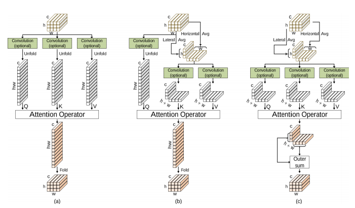

</img>

## Kronecker Attention Pytorch

Implementation of <a href="https://arxiv.org/abs/2007.08442">Kronecker Attention</a> in Pytorch

## Install

```bash
$ pip install kronecker_attention_pytorch
```

## Usage

```python
import torch
from kronecker_attention_pytorch import KroneckerSelfAttention

x = torch.randn(1, 32, 256, 512)

attn = KroneckerSelfAttention(
    chan = 32,
    heads = 8,
    dim_heads = 64
)

attn(x) # (1, 32, 256, 512)
```

## Citations

```bibtex
@article{Gao_2020,
   title={Kronecker Attention Networks},
   ISBN={9781450379984},
   url={http://dx.doi.org/10.1145/3394486.3403065},
   DOI={10.1145/3394486.3403065},
   journal={Proceedings of the 26th ACM SIGKDD International Conference on Knowledge Discovery & Data Mining},
   publisher={ACM},
   author={Gao, Hongyang and Wang, Zhengyang and Ji, Shuiwang},
   year={2020},
   month={Aug}
}
```
